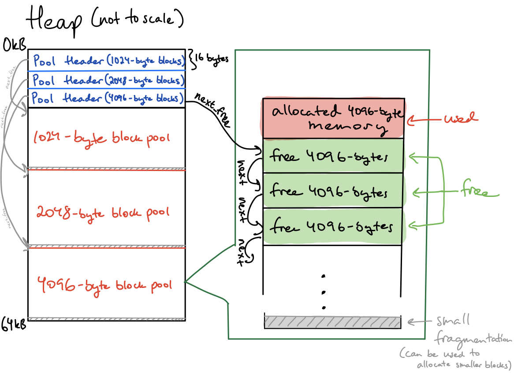

# Zipline Take-Home Challenge: Tunable Block Pool Allocator

### How to compile and run: (on Unix-based OS, see Makefiles for Windows-specific instructions)

Using Autotools:
```
autoreconf --install
./configure
make
make check
cat tests/test-suite.log # view test logs
```

Using CMake:
```
cmake .
make
make test
```

---

### High-level implementation:



### Assumptions:

Conceptual assumptions: Two assumptions are made concerning usage of smaller sized blocks for this particular memory allocator.
1. It's assumed that the user prefers smaller block size allocation and therefore allocates memory for such objects more often.
2. Memory allocations of the same type/size often happen in succession, so we should keep a reference to a pool of said size whenever it is most recently used.

Design decisions and tradeoffs:
1. Heap itself can and should be used to store state.
    1. Tradeoff: This ensures simplicity and elegance in the implementation. We do sacrifice some memory and alignment in the process, but it's fairly negligible.
1. Heap is subdivided evenly by number of pools, giving smaller objects more blocks to allocate into.
1. If a smaller block pool is full, new allocations for said block size take up blocks in the next non-empty pool of greater block size. This is in line with the user preference for smaller block size allocation, even at the expense of larger block size.
    1. Tradeoff: The tradeoff for the last two logistical assumptions is embedded in the assumption itself that smaller objects are more important to the user of this memory allocator and that larger memory allocation has lower precedence. Additionally, this increases internal fragmentation, and we could allocate larger blocks in subsequent pools to be used for smaller block allocations, however we chose to keep the implementation clean and straightforward while respecting the pools with larger block sizes by not packing their individual blocks with smaller ones, increasing the time to which they get returned to the pool due to crowding of smaller blocks in those valid larger blocks.
1. 8-byte alignment (for 64-bit processor): Want to make sure memory accesses are as efficient as possible, so are willing to tradeoff some internal fragmentation (for unaligned allocation sizes) for speed.
1. pool_free() has undefined behavior when passed a pointer is not currently allocated by pool_alloc() (whether because it wasn't allocated in the first place or it was already freed).
    1. We have the ability to detect unaligned pointers and invalid free calls, however we chose to keep in line with how classical free functions operate.
1. pool_init() is only called once per a process.

Valid inputs:
1. The block sizes array is passed in pre-sorted smallest to largest.
    1. Tradeoff: This places burden on the user to provide a specifically formatted block size list. However, with this assumption was made to accomodate O(log(N)) search for pool headers without having to sort the block size array during initialization.
1. No duplicate block sizes are passed into the pool initialization function.
1. No individual block size exceeds its respective allocated pool size.
1. The number of block sizes doesn't exceed 248.
    1. Smallest x for which (2^16 - 16\*x) / x - x > 0 is at x = 248.125.
    1. The largest block size count at which a valid set of block sizes can exist is therefore {1, 2, 3, 4, 5, ..., 246, 247, 248} which, 8-byte aligned, becomes {8, 8, 8, 8, 8, ..., 248, 248, 248}).

### Time and Space Complexity Analysis

```
b = number of pools (up to 248)
N = total number of blocks (up to 8190)
```

`pool_init`
Time - O(b + N)
Space - O(b + N)

`pool_alloc`:
Time - Best Case (Cache Hit): O(1), Average Case (Binary Search): O(log(b)), Worst Case (All Pools Full): O(b)
Space - Best Case (Cache Hit): O(1), Average Case: O(b)

`pool_free`:
Time - O(1)
Space - O(1)

#### Further Future Optimizations
1. Don't populate all block headers at once during initialization. Do it lazily as memory becomes allocated, would bring down initialization to O(b) time and space.
1. Lazy free list generation also allows us to dynamically allocate more memory to different memory sizes based on past usage rather than fixed assumptions on user desires.
1. External fragmentation between pools may be used to hold smaller size objects (e.g. leftover space after a 1024-byte pool may be split up into several 32-byte blocks). Filling leftover external fragmentation exclusively with the smallest memory block size leads to the greatest minimization of external fragmentation while also keeping in line with the assumption that small block size allocations are more desirable.
1. We could alternatively compact all the pools together, combining all the leftover space at the end of the heap, but chose not to do this to simplify pointer arithmetic for indexing into pools and their respective blocks.

